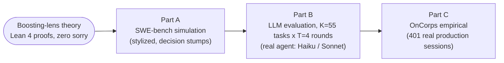

# Audit the Scaffold, Not the Checkpoint

**A Stationarity Dichotomy for Recursive Self-Improvement in Agentic Coding**

Frozen model weights do not by themselves guarantee a saturating self-improvement
trajectory — the quantity to audit is the scaffold. The paper reaches that criterion by
viewing agentic coding through the lens of structured prediction and gradient boosting,
with machine-checked Lean 4 proofs, three complementary experiments, and observational
evidence from real production agentic sessions.

📚 **[arXiv:2609.34924](https://arxiv.org/abs/2609.34924)** — the paper on arXiv (cs.LG).

📄 **[Companion website](https://oncorpsai.github.io/audit-the-scaffold/)** — abstract, figures, and results at a glance (served from [`docs/`](docs/) via GitHub Pages).

[](LICENSE)
[](LICENSE-paper)
[](pyproject.toml)
[](lean_proofs/)

---

## Repository Structure

```
.
├── paper.tex                     # Main paper (NeurIPS 2026 workshop format)
├── paper_appendix.tex            # Full proofs, extended discussion (input by paper.tex)
├── stats_macros.tex              # Shared headline-statistics macros (input by paper.tex)
├── references.bib                # Bibliography
├── neurips_2026.sty              # NeurIPS 2026 style file
│
├── swe_bench_simulations.py      # Part A: SWE-bench simulation (swe_fig1–4)
├── llm_simulations.py            # Part B: LLM evaluation harness (K=55 tasks x 5 seeds, T=4 rounds)
├── scripts/generate_p16_figures.py  # Part B: figure generation from pinned data
├── git_session_extractor.py      # Part C: extract sessions from real repos
├── company_simulations.py        # Part C: OnCorps empirical simulation + fit
├── test_company.py               # Part C: test suite
├── test_llm_simulations.py       # Part B: test suite (>=90% coverage gate)
│
├── lean_proofs/                  # Lean 4 machine-checked proofs (zero sorry)
├── scripts/                      # Helper scripts and figure generators
├── figures/                      # Generated PDF/PNG figures
├── data/                         # Simulation and experiment data (JSON)
│   ├── swe_exp{1,2,3}_results.json          # Part A outputs
│   ├── llm_results_{haiku,sonnet}_{independent,blind,diagnostic}.json  # Part B: the 6 arms
│   │                                        #   (K=55 tasks x 5 seeds; backs every Part B number)
│   ├── llm_*_t4_pinned.json                 # legacy K=20, 1-seed pilot; not used by the paper
│   ├── company_sessions.json                # Part C session data (anonymized)
│   └── company_params.json                  # Part C fitted parameters
├── pyproject.toml                # uv project + lint/type/complexity gates
└── paper.pdf                     # Compiled paper
```

---

## Three-Part Experiment Structure

> **The experiments test the theory at three levels of realism.**



Note the direction of support, which is narrower than it looks. Part A confirms the
machinery is implemented correctly and claims nothing about code or LLM behaviour;
Part B characterizes the regime; Part C is ecological, placing current practice in the
bounded regime **without identifying what causes it** — a pre-AI human baseline shows
the same decay shape, so the dynamics are not AI-specific. See the paper's Limitations
and open problem 4.

### Part A — SWE-bench simulation

**Entrypoint:** `swe_bench_simulations.py`

A stylized theoretical validation using SWE-bench problem-statement TF-IDF features and
synthetic labels, with decision-stump weak learners. Confirms the boosting *mechanics* are
implemented correctly — training error decay, generalization, refinement dynamics, and
margin distribution — and claims nothing about code or LLM behaviour.

**Outputs:** `figures/swe_fig{1,2,3,4}.pdf`, `data/swe_exp{1,2,3}_results.json`

```bash
uv run python swe_bench_simulations.py
```

### Part B — LLM evaluation (K=55 tasks, T=4 rounds)

**Entrypoints:** `llm_simulations.py` + `scripts/generate_p16_figures.py`

Runs a real coding agent (LiteLLM proxy to Claude Haiku/Sonnet, containerized via
Docker) as the per-round weak learner in a boosting/refinement outer loop over SWE-bench
Lite tasks (K=55 tasks x 5 seeds, T=4 rounds, 6 arms). Measures functional solve rates,
per-round quality edge, and margin dynamics.

**Data backing the paper:** the six arm files `data/llm_results_{haiku,sonnet}_{independent,blind,diagnostic}.json`
(K=55 x 5 seeds), plus `data/part_b_edge_overlap.json`. The `*_t4_pinned.json` files are a
legacy K=20 single-seed pilot and back only `figures/llm_fig{1,2,3,4,5}_*_t4_pinned.pdf`,
which the paper does not reference.
**Paper figures:** `figures/llm_fig_edge_collapse.pdf`, `figures/llm_fig_overlap.pdf`,
`figures/llm_fig6_feedback_ablation.pdf`

**Reproduce figures from pinned data** (no LLM calls, no Docker):

```bash
uv run python scripts/generate_p16_figures.py
```

**Run the live harness** (requires LiteLLM proxy, Docker, and SWE-bench images):

| Variable | Default | Meaning |
|---|---|---|
| `LLM_SIM_MODEL` | `claude-haiku-4-5` | LiteLLM model id |
| `LLM_SIM_K` | `5` | number of tasks (the paper's runs use 55) |
| `LLM_SIM_T` | `4` | refinement rounds per task |
| `LLM_SIM_TAU` | `0.6` | pass threshold on quality |
| `LLM_SIM_AGENT` | `mini` | `mini` (real, LiteLLM proxy) or `stub` (offline demo) |

```bash
LLM_SIM_AGENT=stub LLM_SIM_K=8 LLM_SIM_T=5 uv run python llm_simulations.py
```

### Part C — OnCorps empirical study (ecological evidence)

**Entrypoints:** `git_session_extractor.py`, `company_simulations.py`, `test_company.py`

The ecological evidence: 401 real agentic coding sessions (1,211 Claude-authored commits
across 23 production repositories), placing current practice in the bounded regime
without identifying what causes it:

- **Geometric churn decay ρ ≈ 0.77** across consecutive commits — sessions front-load
  edits and converge toward a survivor-ratio ceiling; a commit-order permutation
  test rejects the "large commits happen to come first" null (p < 0.0001, n = 70
  sessions of ≥5 commits). 70.0% of multi-commit sessions show decreasing churn, at a
  median late/early ratio of 0.49. This is the safety-relevant descriptive claim — and
  it is description, not mechanism: the pre-AI human baseline below shows the same shape.
- **A null model-capability gap, robust to a multilevel de-confound**: mean
  survivor ratio τ_Opus ≈ 0.55 (n = 158) vs τ_Sonnet ≈ 0.55 (n = 177); naive
  gap = -0.003, permutation p = 0.93, Mann–Whitney p = 0.91; adjusted tier
  coefficient (task type + repo/developer random intercepts) = +0.009, p = 0.82.
  Since Part B measures a *large* capability effect on the same kind of contrast, read
  this as a fact about the survivor-ratio proxy rather than about the models — and as a
  **bounded** null, not a demonstrated zero. It costs the finding its force as a
  mechanism test and leaves the churn description intact.

**Data:** `data/company_sessions.json` (anonymized: repos labeled `repo_A`..`repo_W`),
`data/company_params.json`
**Outputs:** `figures/emp_fig{1,2,3,4}.pdf`

```bash
# Reproduce figures and fit from committed anonymized data:
uv run python company_simulations.py

# Extract sessions from your own repos (requires access):
export COMPANY_REPOS="/path/to/repo1:/path/to/repo2"
uv run python git_session_extractor.py
```

> **Data sanitization.** The committed `data/company_sessions.json` has been post-hoc
> scrubbed for release. Real repository names are replaced with opaque `repo_A/B/C` labels;
> commit hashes are replaced with synthetic order-stable identifiers (`c0000`, `c0001`, …);
> and all timestamps are coarsened to date granularity (`YYYY-MM-DD`), dropping time-of-day.
> Only structural metrics survive — diff sizes, commit counts, model tier, coarse dates, and
> the session↔commit linkage the fit depends on. No source code, file paths, author
> identities, or commit messages are included. The sanitization pipeline is
> `scripts/anonymize_sessions.py` (the real→anonymous name mapping is supplied out of band,
> never committed). The cached LLM responses (`data/llm_cache/`) *are* included — each entry
> is a SHA-256–keyed model response on a public SWE-bench Lite task (no prompts, secrets, or
> internal references are stored), so the Part B figures reproduce without re-running
> inference. Re-extraction from your own repositories requires `COMPANY_REPOS` pointing to
> repositories the runner has read access to.

---

## Setup

The project is managed with [`uv`](https://docs.astral.sh/uv/).

```bash
uv sync --extra dev
```

Or with standard pip:

```bash
pip install -e ".[dev]"
```

Docker is required only to run the live Part B harness (SWE-bench task containers).
Reproducing figures from pinned data does not require Docker.

---

## Building the Paper

**Tectonic** (recommended):

```bash
tectonic paper.tex
```

**Standard TeX Live:**

```bash
pdflatex paper.tex && bibtex paper && pdflatex paper.tex && pdflatex paper.tex
```

**arXiv bundle:** `make arxiv` writes `arxiv_submit/ax.tar.gz`: comment-stripped sources,
`paper.bbl` in place of `references.bib`, and only the figures the paper includes. It
is verified by compiling the unpacked tarball, and `arxiv_submit/BUILD_MANIFEST`
records the commit it was built from.

---

## Running Tests

```bash
uv run --extra dev pytest -q          # ~35s: the default, slow tests deselected
uv run --extra dev pytest -m "" -q    # ~5m20s: everything, including slow
uv run --extra dev pytest -m slow -q  # just the slow ones
```

The test suite covers Parts B and C with a >=90% coverage gate, enforced by
`--cov-fail-under=90` in `pyproject.toml`. The default run clears it without the
slow tests.

Five tests in `TestControlHeadlineNumbers` are marked `slow` and deselected by
default. They re-run permutation tests and mixed models over the full merged cohort:
measured, they cost **282s of a 318s run** while contributing 2 statements and 2
partial branches that nothing else covers. Because they pin paper-reported numbers,
**run `pytest -m ""` before any paper build or release** — a drift in
`tau_human`/`rho_human` or in the human-vs-Opus gap will only surface there.

Coverage instrumentation, not the tests, dominates the remaining runtime: the full
suite takes 318s with coverage and 77s without. `COVERAGE_CORE=sysmon` does not
help (branch coverage forces the C tracer), so use `--no-cov` for a fast inner loop.

**Additional quality gates.** All of them, in one command that exits non-zero on the
first failure:

```bash
make check
```

That target is the single definition of the gate list. To run one in isolation:

| Gate | Command | Enforces |
| --- | --- | --- |
| Lint | `uv run --extra dev ruff check .` | `E,F,I,B,UP,SIM,S` repo-wide |
| Format | `uv run --extra dev ruff format --check .` | — |
| Types | `uv run --extra dev mypy` | `disallow_untyped_defs` on the `[tool.mypy]` file list |
| Complexity | `uv run --extra dev xenon --max-absolute C --max-modules C --max-average B $(ls *.py) scripts` | every block ≤ CC 20, every file's average ≤ C, whole tree ≤ B |
| Dead code | `uv run --extra dev vulture $(ls *.py) scripts .vulture_allowlist.py --min-confidence 80` | unused imports, variables, functions at ≥80% confidence |
| Module boundaries | `uv run --extra dev tach check` | layer order, no cycles, no undeclared imports |
| Tests + coverage | `uv run --extra dev pytest` | `--cov-fail-under=90` |

`--extra dev` is required: these tools live in the `dev` optional-dependency group,
which plain `uv run` does not install. Without it `uv run <tool>` silently falls
through to whatever happens to be on `PATH` (e.g. a system-wide mypy of a different
version), so the gates would not be running the pinned versions.

**On the complexity gate.** It is `xenon`, not `radon`, and that is the whole point:
`radon cc -n C` — which this README documented as a gate — *cannot fail*. Its `-n/-x`
flags filter what is **displayed** and the process exits 0 no matter what it prints, so
for as long as it was listed here it was a report that nobody read. `xenon` is radon's
own CI companion (same author) and supplies the missing exit code. Use its long flags:
the short forms are `-b` absolute, `-m` modules, `-a` average, which is not the
mnemonic anyone guesses.

The threshold is radon rank **C**, i.e. no block above cyclomatic complexity 20. Scope
is every top-level `.py` plus `scripts/` — 25 files, 840 blocks, tests and the legacy
`simulations.py`/`swe_bench_simulations.py` included, because measured they already
pass and an exception nobody needs is an exception that rots. `lean_proofs/` is out:
its `.lake/packages/mathlib/scripts/` holds 29 vendored third-party files. There is no
allowlist — every block in the repo is genuinely at C or better.

`uv run --extra dev mypy` type-checks `llm_simulations.py`, `company_simulations.py`,
`git_session_extractor.py` and everything under `scripts/`; the file list lives in
`[tool.mypy]`.

The coverage gate is narrower than the type gate, deliberately. It measures the seven
modules listed in `--cov=` flags in `[tool.pytest.ini_options].addopts`:

| Module | Coverage |
| --- | --- |
| `llm_simulations` | 93% |
| `company_simulations` | 93% |
| `git_session_extractor` | 99% |
| `scripts/anonymize_sessions` | 97% |
| `scripts/generate_stats_macros` | 96% |
| `scripts/part_b_edge_overlap` | 93% |
| `scripts/part_c_control_stats` | 100% |

A module joins that list only once it independently clears 90%, so the gate never
depends on slack elsewhere. Two categories are excluded by decision rather than
oversight:

- **CLI entrypoints.** `[tool.coverage.report].exclude_lines` drops `def main()` bodies
  across the board — they are argparse plus orchestration over functions covered
  individually, so measuring them dilutes the number instead of protecting anything.
  The cost of that rule, worth knowing: logic that accumulates *inside* a `main()` is
  not merely uncovered, it is unmeasured, so nothing reports it. Extracting the
  extraction-mode env validation out of `git_session_extractor.main` for the complexity
  gate moved ~50 statements from hidden to visible and dropped that module from 99% to
  87% without a single test changing. It is back at 99% because those statements now
  have tests, but the lesson is that this exclusion hides growth as well as glue.
  This generalises the `# pragma: no cover -- CLI entrypoint` that
  `company_simulations.py:main` already carried inline.
- **Figure generation.** `scripts/generate_p16_figures.py` (209 statements of
  matplotlib) is not gated and is not intended to be; asserting on plot objects buys
  no real protection.

Scripts not yet in the list (`discover_cohorts`, `part_b_paper_numbers`,
`validate_diagnostic_28task`, `gold_patch_diagnostic`) are type-checked but not
coverage-gated yet.

One gotcha if you add a module: `--cov=<dotted.module>` silently measures nothing when
the module is never imported under that name (for instance when a test loads it by file
path under an alias). Coverage emits only a `module-not-imported` warning, so the file
just vanishes from the table while the config still claims to gate it. After adding a
`--cov=` entry, confirm the file actually appears in the coverage table.

---

## Key Results

**Part A (SWE-bench simulation, decision stumps):**
- Training error decays exponentially with the number of weak learners, matching the AdaBoost bound e^{-2γ²T}.
- Generalization is controlled by the VC-dimension of individual agents, not their count.
- Refinement quality increases monotonically but saturates, consistent with the theoretical bound.
- Margin distribution shifts rightward over boosting rounds.

**Part B (LLM evaluation, K=55 tasks x 5 seeds, T=4 rounds, Docker harness):**
- Model tier explains roughly half the variance (partial η² = 0.497); neither feedback mode
  nor the interaction reaches significance, and a bootstrap puts that null at 11%/17%
  power — **underpowered, not evidence of zero effect** (80% power needs 7–8x the sample).
- **No clean unconditional per-round edge is estimable from this data.** The harness stops
  calling the model once a task passes and back-fills a perfect score, so the *pooled* edge
  tracks the solve rate backwards (the stronger tier back-fills more rows and posts a more
  negative pooled edge) and is reported for disclosure only. It is not evidence of the
  weak-learner condition, and nothing downstream needs it — neither the refinement theorem
  nor the dichotomy ever required a positive edge.
- On the cells where a model call actually happened the tiers separate cleanly, but the
  strong tier's first two intervals include zero, so we do not claim it fails the
  weak-learning condition either.
- Refinement goes **idempotent** rather than wrong: ties run 80–95% of transitions against
  at most 2.9% that lower quality. An unchanged round is an *abstention*, so the
  confidence-rated bound still descends — to 0.81 (Haiku) and 0.67 (Sonnet) over three rounds.
- Mean per-round improvement on the running best falls toward zero — saturation measured
  rather than argued. This is what places Part B in the bounded regime.
- **Failure overlap sits at its ceiling.** Across 6 same-family configurations (30 workers
  across seeds) the tight overlap is m\* = k at every round: some task defeats every
  worker, and a majority fails 23/55 (42%) of tasks — which *is* the majority vote's error.
  Same-family workers only, so this settles the pessimistic half and cannot speak to
  whether different vendors clear the bar (open problem 2).

**Part C (OnCorps empirical, 401 real sessions):**
- Churn decays geometrically across commits (ρ ≈ 0.77); a commit-order permutation test rejects the "large commits happen to come first" null (p < 0.0001), so the ordering is genuinely temporal; sessions converge to a survivor-ratio ceiling. Note this does *not* reject a generic-editing null — the human baseline below shows generic editing produces the same shape.
- Null capability gap, robust to a multilevel de-confound: τ_Opus ≈ 0.55 (n = 158) vs τ_Sonnet ≈ 0.55 (n = 177); permutation p = 0.93, MWU p = 0.91; adjusted tier coefficient = +0.009, p = 0.82.
- The null is not an artifact of pooling model versions: re-tested as a monotone trend over 8 version-resolved capability cells it still finds nothing (ρ = +0.012, p = 0.82). It is a *bounded* null, not a demonstrated zero — the adjusted interval still admits a 0.155 swing across the capability range.
- Survivor analysis and session-length distributions are consistent with the bounded regime —
  but so is ordinary editing, which is exactly what the human baseline below establishes.
  Separating the two needs weights held fixed while the scaffold varies (open problem 4);
  this data motivates that design without delivering it.
- Pre-AI human baseline (9,395 sessions, disjoint older cohort of repos, matched observation window, manually curated 62-person roster): the churn-decay **shape** is essentially the same as the AI tier (ρ_human = 0.86 vs ρ_AI = 0.77), but the survivor-ratio **level** differs — gap = −0.160 vs Opus, permutation p = 0.0002, and it survives crossed repository/developer adjustment (+0.145). Descriptive era contrast, not a controlled comparison; see the appendix for the full caveats.
- Within-era check (same developers, same window, split on whether a commit carries a Claude trailer) removes both the person and era confounds and points the same way (τ = 0.540 vs 0.419), but only one of the two paired tests reaches significance and task selection is uncontrolled — suggestive, not established. A pre-AI within-developer pairing cuts *against* the gap.

---

## Lean 4 Machine-Checked Proofs

The `lean_proofs/` directory contains Lean 4 proofs of the paper's core theorems, with
zero `sorry` and zero custom axioms. See [lean_proofs/README.md](lean_proofs/README.md)
for the per-file breakdown; the authoritative statement-to-declaration map is the paper's
Formalization Index (Appendix H), and `test_lean_index.py` fails the build if the two
drift apart — a dangling declaration name, a stray `sorry` or `axiom`, or a result with
no index row.

---

## Citation

```bibtex
@misc{bobadillasuarez2026agentic,
  title         = {Audit the Scaffold, Not the Checkpoint: A Stationarity Dichotomy
                   for Recursive Self-Improvement in Agentic Coding},
  author        = {Bobadilla-Suarez, Sebastian and Suh, Bob and Fortin, Ryan},
  year          = {2026},
  eprint        = {2609.34924},
  archivePrefix = {arXiv},
  primaryClass  = {cs.LG},
  url           = {https://arxiv.org/abs/2609.34924}
}
```

A machine-readable [`CITATION.cff`](CITATION.cff) is also provided.

---

## License

- **Code** (Python, Lean, shell, configuration) — [MIT License](LICENSE).
- **Paper, figures, and anonymized data** (`paper.tex`, `paper_appendix.tex`,
  `stats_macros.tex`, `figures/`, `data/`) — [Creative Commons Attribution 4.0
  International (CC BY 4.0)](LICENSE-paper).

Copyright © 2026 OnCorps.

---

## AI Authorship Disclosure

Portions of this paper and the accompanying code were drafted with the assistance of
large language models (Claude Opus and Claude Sonnet). All results were verified by
human authors, and all empirical claims were checked against the committed data and
figures.
